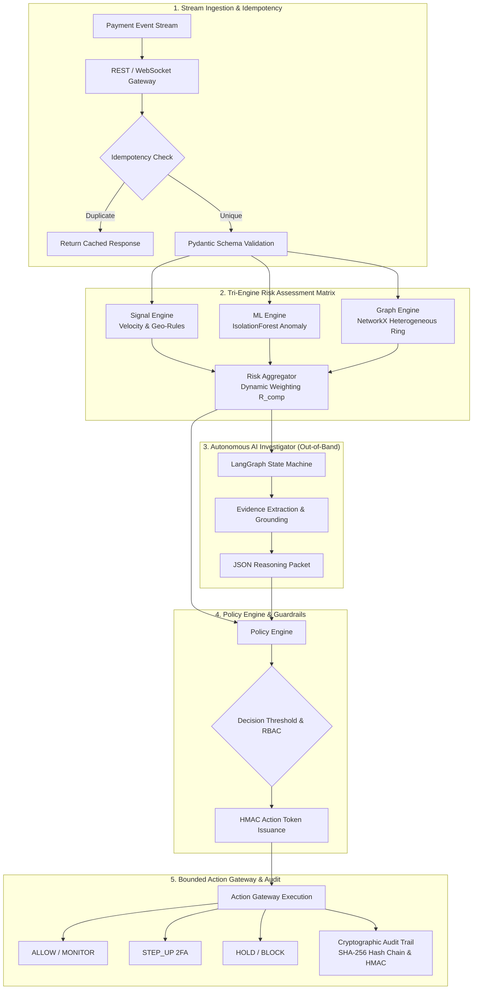
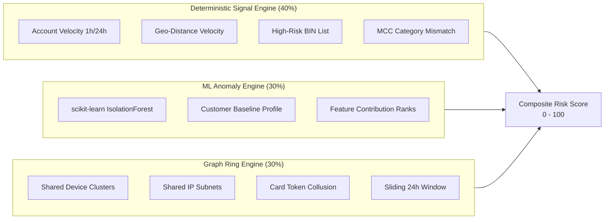
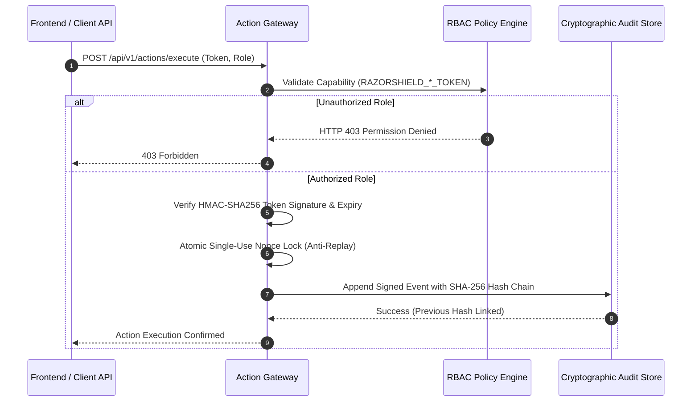

# RazorShield AI — Real-Time Coordinated Fraud Defense Engine

> **RazorShield AI** is an autonomous, high-throughput payment-risk control-plane prototype designed for financial transaction risk detection, AI agent investigation, policy enforcement, single-use action tokens, and cryptographic auditability. Built in compliance with OWASP transaction-authorization security guidance and WCAG 2.2 accessibility principles.

---

## 🏛️ System Architecture

RazorShield AI is structured as a **modular monolith** with strict domain isolation between synchronous event stream ingestion, real-time risk engines, graph cluster analysis, out-of-band AI agent investigation, policy validation, action authorization, and immutable audit logging.



---

## ⚡ Tri-Engine Risk Assessment Matrix

The synchronous critical fast path ($P95 \approx 35\text{ ms}$) processes incoming transactions through three complementary risk calculation engines:



---

## 🛡️ Security & Authorization Architecture

RazorShield AI enforces zero-trust authorization patterns to protect payment networks from unauthorized actions and prompt injection attacks:



---

## 🔒 Policy Engine Decision Tiers

- **`0 – 30`** $\rightarrow$ **`ALLOW`** (Instant zero-friction clearance)
- **`31 – 60`** $\rightarrow$ **`MONITOR`** (Telemetry logging)
- **`61 – 80`** $\rightarrow$ **`STEP_UP`** (2FA OTP verification challenge)
- **`81 – 95`** $\rightarrow$ **`HOLD`** (Manual analyst review queue)
- **`> 95`** $\rightarrow$ **`BLOCK`** (Hard reject — policy engine enforced)

---

## 📊 Track 02 Held-Out Evaluation Benchmark

RazorShield AI evaluates 4 detector tiers against an isolated, untouched 500-record held-out dataset (`data/evaluation/test.jsonl`, 77 fraud, 423 benign):

| Detector Configuration | Precision | Recall | F1 Score | FPR | Total Expected Loss (₹250 FP Cost)* |
| :--- | :---: | :---: | :---: | :---: | :---: |
| **`ML_ONLY` (IsolationForest)** | **44.83%** | 50.65% | **47.56%** | **11.35%** | ₹37,46,815.92 |
| **`RULES_PLUS_ML` (Hybrid)** | 15.27% | **89.61%** | 26.09% | 90.54% | **₹1,17,330.82** |
| **`RULES_ML_GRAPH` (Tri-Engine)**| 15.51% | 87.01% | 26.33% | 86.29% | ₹8,63,423.32 |
| **`RULES_ONLY` (Baseline)** | 21.36% | 81.82% | 33.88% | 54.85% | ₹5,96,782.94 |

*\*Methodology Note: ₹250 is a synthetic intervention-cost assumption used for benchmark comparison (modeling 2FA customer drop-off friction rather than payment cancellation).*

---

## 🔒 Note on Authentication & Production Deployment Realism

1. **Authentication:** The UI includes an explicit `DEV ROLE SIMULATION` selector to allow testing RBAC capability boundaries (`AUDITOR`, `RISK_ANALYST`, `OPERATOR`, `ADMIN`) in local development mode.
2. **Authorization:** All authorization checks are enforced **server-side** on every API endpoint (`RBACPolicyGateway.require_capability`). Client-side button hiding or modal input requirements (`"EXECUTE"`) are purely UI double-confirmation controls.
3. **Production Deployment Requirements:** Production deployment requires integrating an external Identity Provider (OIDC/Okta/SAML), session cookie management, MFA/2FA step-up prompts, and cloud KMS secret key management.

---

## 🚀 Quick Start & Environment Setup

### 1. Copy Environment Template
```bash
cp .env.example .env
```

### 2. Configure API Keys (Optional)
```env
LLM_PROVIDER=gemini
LLM_MODEL_NAME=gemini-3.6-flash
GEMINI_API_KEY=your_gemini_api_key_here
```

### 3. Run Quality & Environment Checks
```bash
python scripts/check_environment.py
python scripts/quality_check.py
```

### 4. Start Server
```bash
python -m uvicorn backend.app.main:app --reload
```
Navigate to `http://localhost:8000` to view the compiled Command Center SPA.

### 5. Reproduce Benchmark with 1 Command
```bash
python scripts/run_evaluation.py
```

---

## 📚 Complete System Documentation Index

- 🏛️ **Architecture & Systems Design**:
  - [System Architecture Specification](docs/architecture/ARCHITECTURE.md)
  - [AI Agent State Machine Specification](docs/architecture/AGENT_DESIGN.md)
  - [Failure Recovery & Circuit Breakers](docs/architecture/FAILURE_RECOVERY.md)
  - [Architectural Decision Records (ADRs)](docs/decisions/ADR_INDEX.md)

- 🛡️ **Security, Safety & Threat Modeling**:
  - [Security Model & RBAC Specification](docs/security/SECURITY_MODEL.md)
  - [STRIDE Threat Model](docs/threat-model/THREAT_MODEL.md)
  - [AI Safety & Evidence Grounding Schema](docs/ai-safety/AI_SAFETY.md)

- 📊 **Product Specifications & Benchmarking**:
  - [Product Specification](docs/product/PRODUCT_SPEC.md)
  - [Held-Out Evaluation Benchmark Report](docs/evaluation/HELDOUT_EVALUATION.md)
  - [Data Model & Risk Schema](docs/data-model/DATA_MODEL.md)
  - [API Contracts](docs/api/API_CONTRACT.md)
  - [Forensic System Audit](docs/audit/FINAL_FORENSIC_SYSTEM_AUDIT.md)
  - [Clean Checkout Reproduction Guide](docs/audit/CLEAN_CHECKOUT_REPRODUCTION.md)
