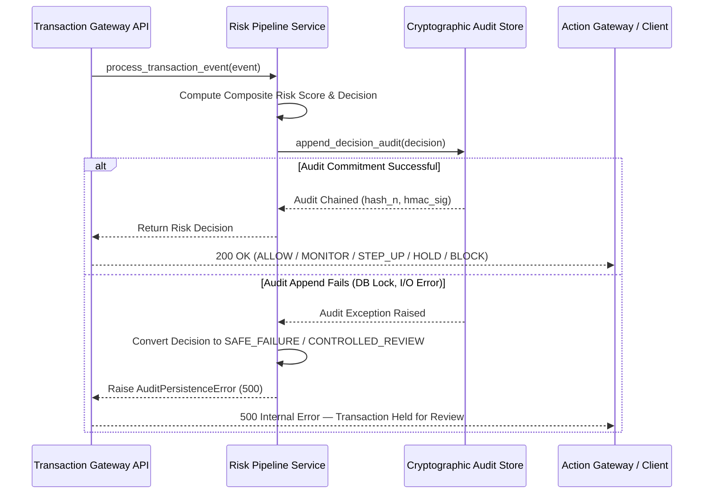

# RazorShield AI — Failure Recovery & Safe Failure Invariants

## 1. Executive Summary

This document specifies the resilience, degraded mode matrix, and safe-failure invariants enforced across the RazorShield AI Risk Platform.

---

## 2. Audit Append Failure Policy (FAIL-CLOSED INVARIANT)

### Invariant Statement
> **"No transaction risk decision shall be returned as successful (`200 OK`) to an upstream payment system if its cryptographically signed audit record cannot be durably committed to the audit store."**

### Rationale
In payment risk platforms, silent failure of audit recording compromises regulatory compliance, dispute resolution, and post-incident investigation. Logging and continuing silently is an unacceptable security smell.

### Sequence & Fail-Closed Recovery Flow

---

## 3. Idempotency Outage & Degradation Matrix

| Environment | Primary Engine | Outage Event | Mandated Resilience Behavior |
| :--- | :--- | :--- | :--- |
| `production` | Redis Cluster | Redis Node Offline / Connection Refused | **Fail Closed:** Reject transaction with `503 Dependency Unavailable` or divert to synchronous manual review. Silent in-memory uncoordinated fallback is strictly forbidden. |
| `local` / `testing` | SQLite Local Store | SQLite File Locked | Fallback to in-memory atomic claim dictionary (`SQLiteIdempotencyStore`). |

---

## 4. Tri-Engine Degraded Weighting Matrix

| Engine Health State | Active Weighting Formula | Description |
| :--- | :--- | :--- |
| `NORMAL_ALL_SYSTEMS` | $R = 0.40 R_s + 0.30 R_m + 0.30 R_g$ | All engines operational. |
| `DEGRADED_NO_ML` | $R = 0.60 R_s + 0.00 R_m + 0.40 R_g$ | ML model unattached or timing out (>15ms). |
| `DEGRADED_NO_GRAPH` | $R = 0.60 R_s + 0.40 R_m + 0.00 R_g$ | Graph database unattached or timing out (>15ms). |
| `DEGRADED_RULES_ONLY` | $R = 1.00 R_s + 0.00 R_m + 0.00 R_g$ | Rules engine baseline execution. |
